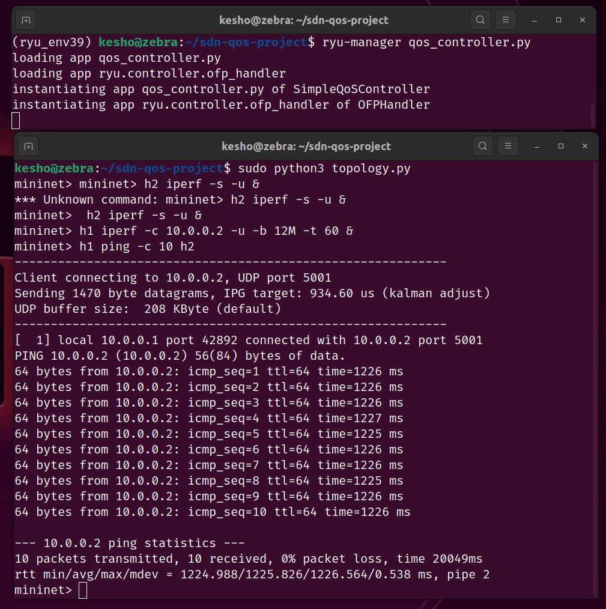
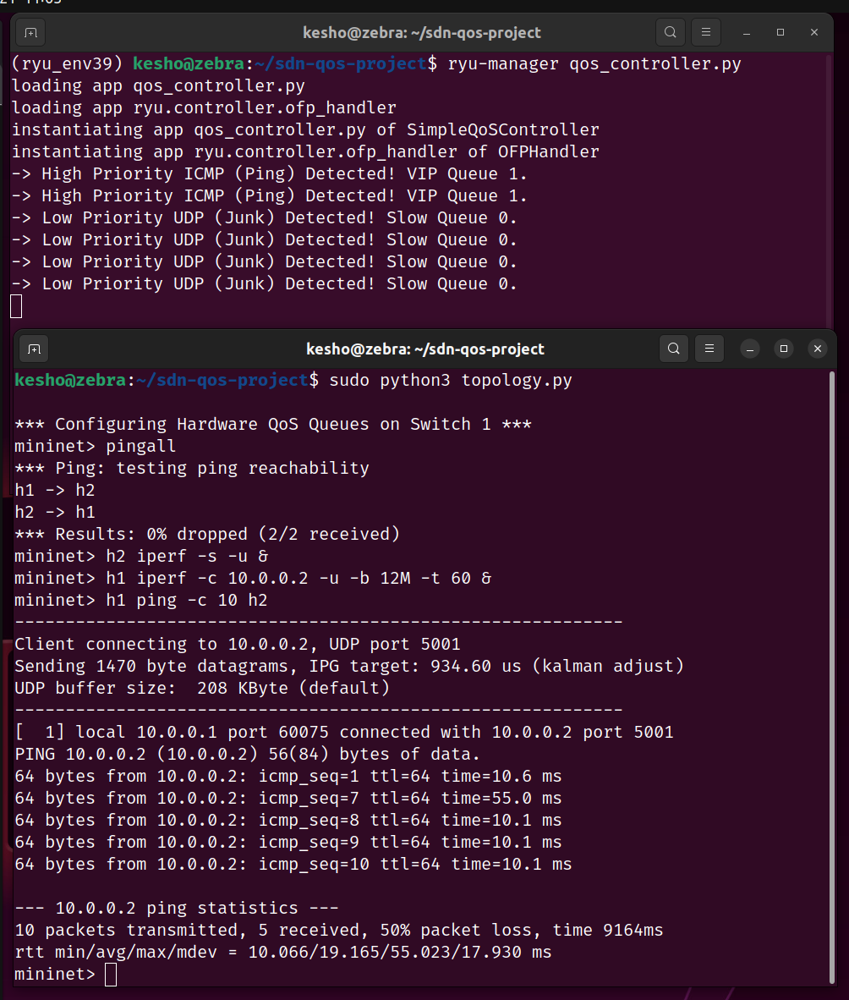

# SDN Mininet Project: Quality of Service (QoS) Priority Controller

---

## 1. Problem Statement & Objective

In traditional networks, switches handle traffic on a "Best Effort" basis. When a network link becomes congested, all packets—regardless of importance—are delayed or dropped equally, leading to massive latency spikes (bufferbloat).

**Objective:** Implement an SDN-based solution using **Mininet** and an **OpenFlow controller (Ryu)** that demonstrates controller-switch interaction and explicit match-action flow rule design.

The custom controller acts as an intelligent policy engine that:
- Actively identifies traffic types
- Dynamically assigns priority levels using OpenFlow hardware queues
- Ensures critical traffic maintains low latency even during extreme network congestion

---

## 2. Topology & Design Choice

The topology consists of a **single Open vSwitch (OVS)** connected to two virtual hosts (`h1` and `h2`) via virtual links with an innate **5ms delay** to simulate real-world traversal.

**QoS Design using Linux HTB (`linux-htb`):**

Physical OVS ports are provisioned using the Linux Hierarchical Token Bucket algorithm via `ovs-vsctl` commands to avoid conflicts with Mininet's software-level bandwidth limits.

| Queue | Lane | Rate |
|-------|------|------|
| Queue 0 | Slow Lane | Max **2 Mbps** |
| Queue 1 | VIP Lane | Min **8 Mbps** (Max 10 Mbps) |

---

## 3. SDN Logic & Flow Rule Implementation

The custom Ryu controller (`qos_controller.py`) handles **OpenFlow 1.3 `packet_in` events** and executes strict match-action logic:

1. **Traffic Interception:** Unrecognized packets trigger a `packet_in` event, sending the packet header to the controller.
2. **Traffic Identification:** The controller matches `eth_type` to confirm IP traffic (bypassing early ARP broadcasts), then evaluates the `ip_proto` header.
3. **Match & Action Rule Design:**

| Protocol | Action | Queue |
|----------|--------|-------|
| **ICMP** (Protocol 1) | `OFPActionSetQueue(1)` | VIP Queue — high priority |
| **UDP** (Protocol 17) | `OFPActionSetQueue(0)` | Slow Queue — throttled to 2 Mbps |

---

## 4. Setup and Execution

### Prerequisites

| Category | Requirement |
|----------|-------------|
| OS | Ubuntu Linux |
| Dependencies | Mininet, Open vSwitch, `iperf` |
| Controller Framework | Ryu (Python 3.9 virtual environment) |

---

### Part A: Baseline — Failure Scenario (Without QoS)

Observe how a standard switch fails under network congestion.

**Terminal 1 — Start the Basic Controller:**
```bash
source ryu_env39/bin/activate
ryu-manager basic_controller.py
```

**Terminal 2 — Launch Mininet and Create Congestion:**
```bash
sudo python3 topology.py

# Set up Host 2 as a background UDP receiver
mininet> h2 iperf -s -u &

# Flood the network with 12 Mbps of background UDP traffic
mininet> h1 iperf -c 10.0.0.2 -u -b 12M -t 60 &

# Measure latency of critical ICMP traffic during the flood
mininet> h1 ping -c 10 h2
```

**Expected Result:** Ping packets get trapped behind the UDP flood. Latency spikes severely (**1000ms+**), demonstrating bufferbloat.



---

### Part B: Network Reset

Before testing the QoS solution, wipe the switch state completely.

- **Terminal 1:** Press `Ctrl + C` to stop `basic_controller.py`
- **Terminal 2:** Type `exit` to close Mininet
- **Terminal 2:** Run `sudo mn -c` to clean up the virtual network

---

### Part C: QoS Solution — Normal Scenario (With QoS)

Apply SDN intelligence to prioritize critical traffic.

**Terminal 1 — Start the QoS Controller:**
```bash
# make sure you are still in the ryu_env39 virtual environment
ryu-manager qos_controller.py
```

**Terminal 2 — Launch Mininet and Recreate Congestion:**
```bash
sudo python3 topology.py

# Verify basic connectivity
mininet> pingall

# Start the exact same 12 Mbps UDP flood
mininet> h2 iperf -s -u &
mininet> h1 iperf -c 10.0.0.2 -u -b 12M -t 60 &

# Test critical ICMP traffic again
mininet> h1 ping -c 10 h2
```

**Expected Result:** The controller intercepts traffic, throttles the UDP flood to Queue 0 (2 Mbps), and routes ICMP pings to VIP Queue 1 — resulting in stable latency of **10–55ms** despite ongoing congestion.



---

## 5. Performance Analysis

| Metric | Without QoS | With QoS |
|--------|-------------|----------|
| ICMP Latency (under flood) | 1000ms+ | 10–55ms |
| UDP Throughput Control | None | Capped at 2 Mbps |
| Traffic Differentiation | None | Per-protocol via OpenFlow |

Without SDN intelligence, throughput demands dictate performance, causing severe bufferbloat. By utilizing **OpenFlow match-action flow rules**, critical traffic is successfully decoupled from background noise — proving that application-layer logic deployed at the controller level can directly manipulate hardware forwarding behavior to enforce Quality of Service.

---

## 6. References

- Open Networking Foundation (ONF) — *OpenFlow Switch Specification v1.3.0*
- Mininet Python API Documentation
- Ryu SDN Framework Documentation
- Open vSwitch QoS Configuration (`linux-htb`) Manual
-----
